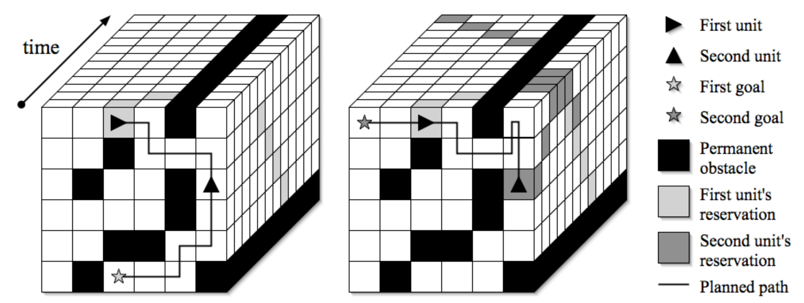

# Space-Time A*    

Space-Time A* (STA*) Search Algorithm with an Additional Time Dimension to Deal with Dynamic Obstacles.


## Installation

The package is named `space-time-astar` and listed on [PyPI](https://pypi.org/project/space-time-astar/). You can use the pip to install:

```bash
pip3 install space-time-astar
```

For multiple agents, you might be interested in the `cbs-mapf` package which uses this package as the low-level planner, also on [GitHub](https://github.com/GavinPHR/Multi-Agent-Path-Finding) and [PyPI](https://pypi.org/project/cbs-mapf/).

## Usage

### Import Planner

```python
from stastar.planner import Planner
```

### Constructor Parameters
```python
Planner(grid_size: int, robot_radius: int, static_obstacles: List[Tuple[int, int]])
```
- **grid_size**: int - each grid will be square with side length **grid_size**. 
- **robot_radius**: int - agents are assumed to be circles with radius being **robot_radius**.
- **static_obstacles**: List[Tuple[int, int]] - A list of coordinates specifying the static obstacles in the map.

It is important that **grid_size** is not too small and **static_obstacles** does not contain too many coordinates, otherwise the performance will severely deteriorate. What is 'too many' you might ask? It depends on your requirements.

### Find Path
Use `Planner`'s `plan()` method:
```
plan(start: Tuple[int, int],
     goal: Tuple[int, int],
     dynamic_obstacles: Dict[int, Set[Tuple[int, int]]],
     semi_dynamic_obstacles:Dict[int, Set[Tuple[int, int]]] = dict(),
     max_iter:int = 500,
     debug:bool = False) -> np.ndarray:
```
#### Parameters:
- **start**: Tuple[int, int] - A start coordinate.
- **goal**: Tuple[int, int] - A goal coordinate.
- **dynamic_obstacles**: Dict[int, Set[Tuple[int, int]]] - Dynamic obstacles are really other agents reservation in space-time, more details below.
- **semi_dynamic_obstacles**: Dict[int, Set[Tuple[int, int]]], *optional* - This parameter exist because we have to take the agents that have reached their destinations into account, they are essentially static obstacles from specific times.
- **max_iter**: int, *optional* - Max iterations of the search. Default to `500`. 
- **debug**: bool, *optional* - Prints some debug message. Default to `False`.

The keys for **dynamic_obstacles** are integers representing time and the values are sets of coordinates. It tells the planner what coordinates we need to avoid at each time step. Currently, it is assumed that dynamic obstacles are other agents (with the same **robot_radius**) and are treated differently to static obstacles.

#### Return:
A `numpy.ndaarray` with shape `(L, 2)` with `L` being the length of the path. 

## Theoretical Background

[Here](http://www0.cs.ucl.ac.uk/staff/D.Silver/web/Applications_files/coop-path-AIWisdom.pdf) is a good document about Space-Time A* (STA*) written by David Silver.

In a nutshell, STA* is normal A* plus a time dimension. See the illustration below.

<p align="center">
  
</p>

On the left block, the first agent plans its path and reserve its path through time (with no regard to the second agent).

On the right block, the second agent plans its path while avoiding the path reserved by the first agent (i.e. the **dynamic_obstacles** argument).

### Implementation decisions in `space-time-astar` package

- The Manhattan distance, an admissible and consistent heuristic, is used in this implementation. You can change this by changing the `h()` function in `planner.py`. 

- The agents can be bigger than the grid. 

- The dynamic obstacles are assumed to be other agents of the same size. This can be changed in the `safe_dynamic()` inner function in `plan()`.


## Contributing
Pull requests are welcome. For major changes, please open an issue first to discuss what you would like to change.


## License
[MIT](https://opensource.org/licenses/MIT)

